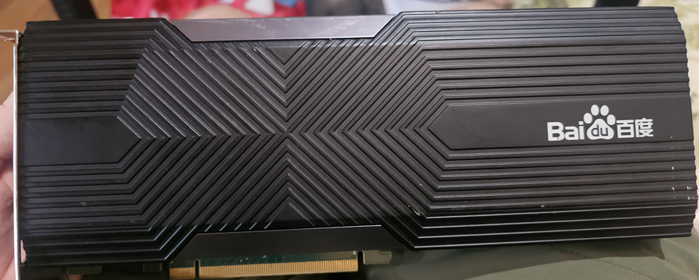

# Kunlun K200

A first-generation Baidu Kunlun card (`1d22:3684`, KL1, two dies). This repo is the setup guide, the clock tool, and the GEMM numbers for that card.



Start with the [glossary](docs/glossary.md) if the names are new. Use Ubuntu **22.04** and a **6.8** kernel. Ubuntu 24.04, XRE 5, and R200 / P800 wheels are a later chip.

## What works

| Piece | Version |
|-------|---------|
| Card | K200, firmware `0001.0008.0016`, two `/dev/xpu*` |
| OS | Ubuntu 22.04, kernel 6.8, gcc-12 for the module |
| Runtime | XRE 4.33 userspace, `kunlun.ko` from [kunlun_k200](https://github.com/mobius/kunlun_k200) |
| Library | XDNN `libxpuapi.so` in `third_party/xdnn/` |
| Compiler | XTDK clang-10, run under `qemu-aarch64` |
| Models | Paddle `paddlepaddle_xpu` 2.6.1, Python 3.10, NumPy 1.x |

Everyday core clock is **900 MHz**. 1000–1250 MHz runs; **1300 MHz faulted** the card. Do not OTA or OTP the firmware.

## Three commands

```bash
sudo XRE_TARBALL=/path/to/xre-ubuntu_2004_x86_64.tar.gz \
     XPU_SDK_TARBALL=/path/to/xpu_sdk_v2.0.0.61.tar.gz \
     bash setup/install.sh

bash bench/profiles/int8.sh          # library GEMM at the current clock
bash clock/set-mhz 1000              # core PLL only; HBM stays 1000
```

Owned pipes: `bash bench/run-pipe.sh int8`. After install, `k200-smoke` checks a copy and a tiny `fc` on both dies.

## Docs

- [Hardware, BOM, BIOS, cooling](docs/hardware.md)
- [Driver, XRE, XTDK](docs/setup.md)
- [Benchmarks and clock](docs/benchmarks.md)
- [What the card actually does](docs/performance.md)
- [Programming notes](docs/programming.md)
- [Paddle ResNet50](docs/paddle.md)
- [When it goes wrong](docs/troubleshooting.md)
- [Links](docs/links.md)

`libxpuapi.so` is Kunlunxin’s library, not covered by the MIT license. See [THIRD_PARTY.md](THIRD_PARTY.md).
